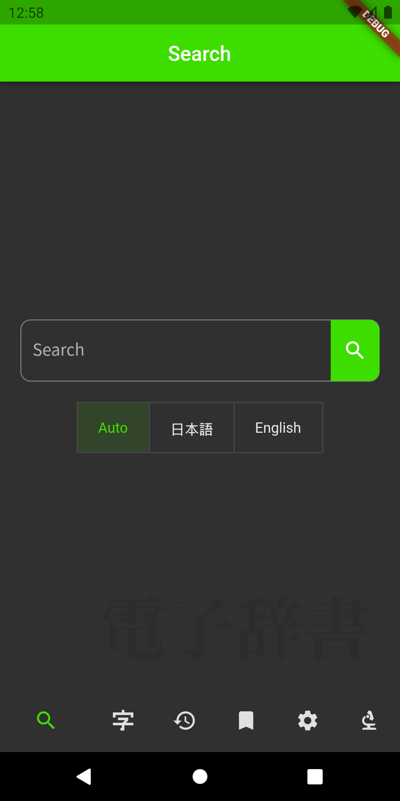
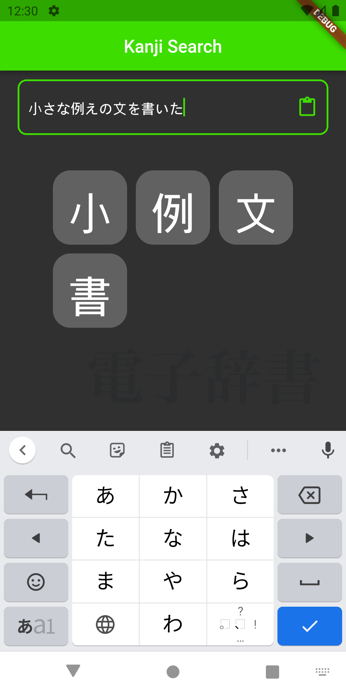
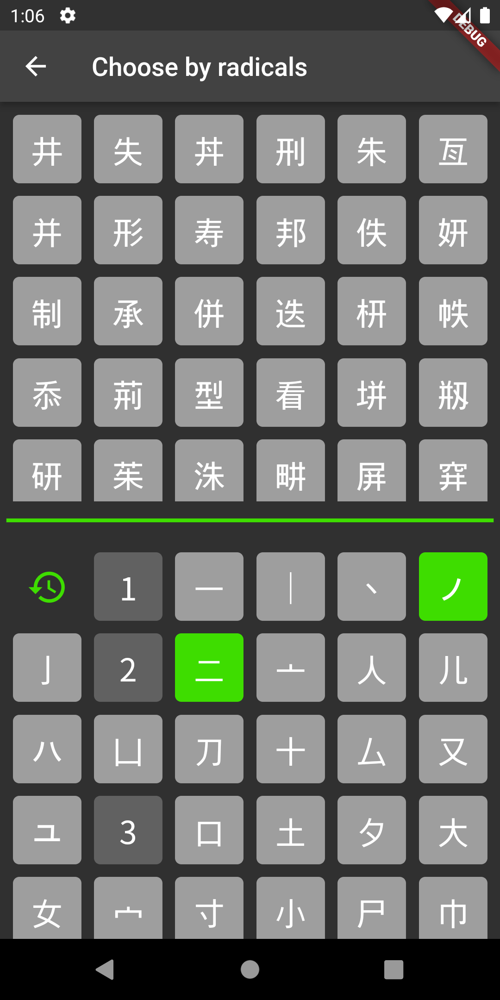
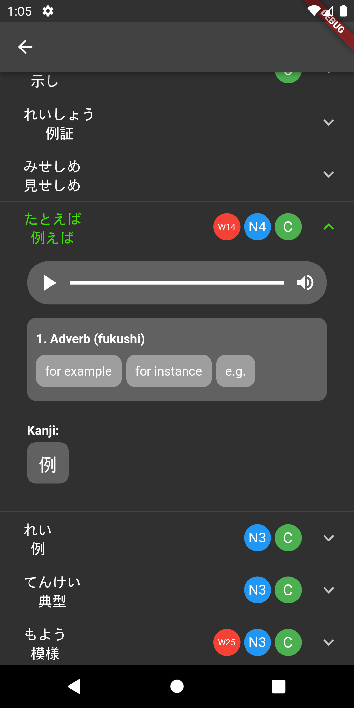
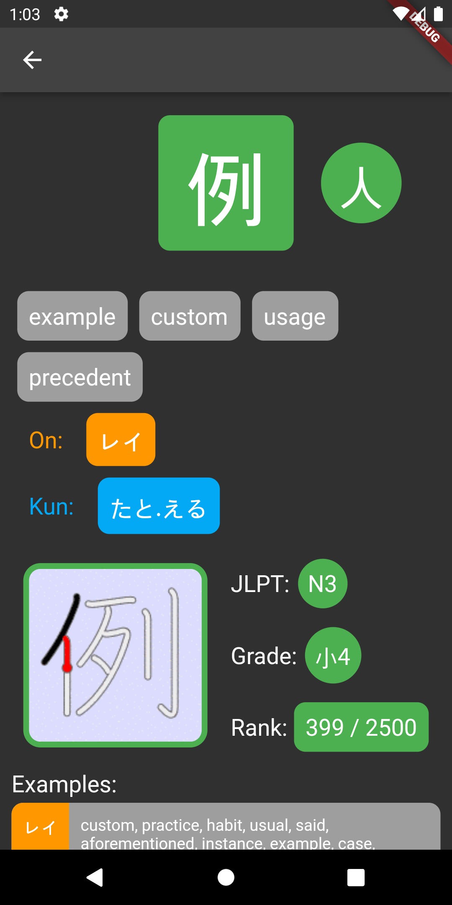
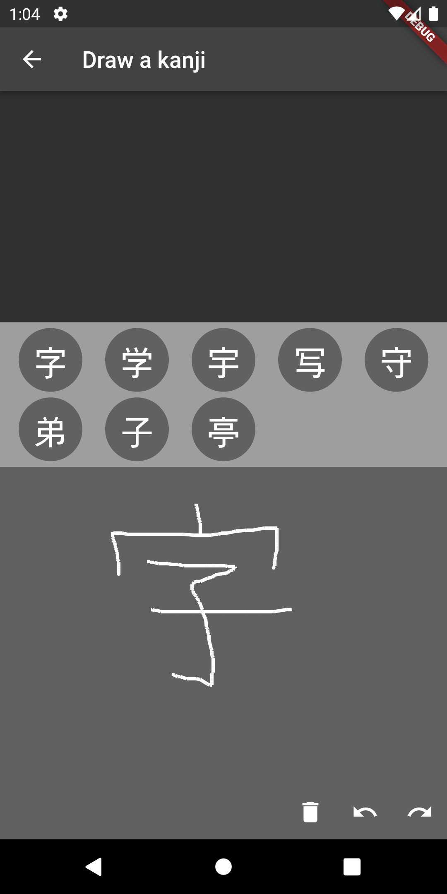

<h1>
  <ruby>
    麦
    <rp>（</rp><rt>むぎ</rt><rp>）</rp>
    典
    <rp>（</rp><rt>てん</rt><rp>）</rp>
  </ruby>
  / Mugiten
</h1>

A japanese dictionary as a study tool.

## Screenshots

  
  
  

  
  
  

